# 🧠 Customer360 Platform

## 🎯 Overview
Customer360 is a **real-time, AI-augmented data platform** built to unify customer data, events, and transactions across multiple source systems — enabling **360° analytics and personalization** at scale.

This project demonstrates **end-to-end data engineering mastery** using AWS, Snowflake, dbt, Airflow, and Terraform.

---

## ⚙️ Tech Stack

| Layer | Tools & Services |
|-------|------------------|
| **Ingestion** | AWS DMS, Kinesis, S3 |
| **Processing** | Glue, EMR (PySpark), Lambda |
| **Modeling** | dbt (SCD2 + testing) |
| **Storage** | Snowflake + S3 Data Lake |
| **Orchestration** | Airflow (local or MWAA) |
| **IaC / DevOps** | Terraform, GitHub Actions, CodePipeline |
| **AI Enrichment** | Bedrock / OpenSearch / pgvector |
| **Observability** | CloudWatch, Cost Explorer, DQ checks |

---

## 🧩 Project Phases

| Phase | Description | Status |
|--------|-------------|--------|
| 0 | [Environment Setup & Tool Installation](#p0) | ✅ Complete |
| 1 | [Architecture Blueprint (Mermaid Diagram)](#p1) | ⏳ WIP | 
| 2 | [Terraform Foundations (S3, IAM, Glue, Snowflake Stage)](#p2) | ⏳ |
| 2.5 | [Source Simulation (MySQL, Postgres, Kinesis, Batch)](#p2_5) | ⏳ |
| 3 | [Ingestion Pipelines (DMS → Kinesis → S3 → Glue)](#p3) | ⏳ |
| 4 | [Processing Layer (EMR / PySpark Jobs)](#p4) | ⏳ |
| 5 | [Modeling (dbt + SCD2 + Tests)](#p5) | ⏳ |
| 6 | [Orchestration (Airflow DAGs)](#p6) | ⏳ |
| 7 | [API Exposure (Lambda + API Gateway)](#p7) | ⏳ |
| 8 | [Observability (Metrics + Alerts)](#p8) | ⏳ |
| 9 | [Documentation & Cost Governance](#p9) | ⏳ |
| 10 | [AI Enrichment (Vector DB + Bedrock)](#p10) | ⏳ |

---

## 🗂️ Repository Structure

<a name="p0"></a>
# ✅ Phase 0 — Environment Setup & Tool Installation (Completed)

## 🎯 Objective
Establish a fully functional local development environment for the **Customer360** project — ready to build, deploy, and version-control AWS infrastructure and data engineering components.

---

## 🧠 Summary of Work Completed

### 🧩 System & Tool Setup
| Step | Tool | Status | Notes |
|------|------|--------|--------|
| 0.1 | **System Check** | ✅ | macOS ARM64 verified; Docker skipped for now |
| 0.2 | **Terraform CLI** | ✅ | Installed v1.13.4 via Homebrew |
| 0.3 | **AWS CLI + Profile (`c360`)** | ✅ | Configured and authenticated with `aws sts get-caller-identity` |
| 0.4 | **Python 3.9 + venv** | ✅ | Created environment `~/.venvs/c360`; core libs installed: boto3, awswrangler, faker, pyspark, pandas |
| 0.4.1–0.4.3 | **Project Scaffolding** | ✅ | Repo initialized with folders, `.gitignore`, and `README.md` |
| 0.4.4–0.4.6 | **Git & GitHub Setup** | ✅ | Repo pushed to `https://github.com/imihran/customer360.git` using HTTPS |
| 0.4.7 | **SSH Keys (Optional)** | ✅ | Skipped — HTTPS auth works via macOS Keychain |

---

## 🗂️ Folder Structure
```text
customer360/  
├── terraform/ — Terraform IaC modules  
├── src/ — Python ETL, Lambda, Glue scripts  
├── dbt/ — dbt models & tests  
├── airflow/ — DAGs & orchestration configs  
├── simulator/ — Synthetic data generators (MySQL, Kinesis)  
├── docs/ — Architecture diagrams & runbooks  
├── .gitignore  
└── README.md
```
---

## 🧩 Python Environment Summary
- Python 3.9.6  
- Virtual env: `~/.venvs/c360`  
- Installed libraries:
  - boto3  
  - awswrangler  
  - faker  
  - pyspark  
  - pandas  
- Verified with:  
  `python -c "import boto3, pyspark, pandas; print('✅ Python env ready')"`

---

## ✅ Phase 0 Outcome
A **production-ready local dev environment** with:
- AWS CLI + Terraform authentication  
- Python virtual env for Glue/EMR work  
- Git version control + GitHub repo  
- Organized project scaffolding and docs

---

<a name="p1"></a>
# 🧭 Phase 1 — Architecture Blueprint  
*Customer 360*

---

## 🎯 Objective
Design an end-to-end architecture that unifies all customer data — structured, semi-structured, and unstructured — into a single, queryable, AI-enriched 360-view.

---

## 🧩 Logical Layers

| Layer | Description | Tools |
|-------|--------------|-------|
| **Sources** | Origin systems producing customer data | MySQL / Postgres, Kinesis, JSON/CSV/XML files, S3 batch drops, unstructured PDF/Text feeds |
| **Ingestion** | Capture and land raw data | DMS, Kinesis Data Streams / Firehose, Lambda uploaders |
| **Storage – Raw Zone** | Immutable store of raw inputs (partitioned by date/source) | Amazon S3 (raw) + Glue Data Catalog |
| **Processing – Staging** | Cleansing, deduping, schema normalization | AWS Glue ETL / EMR (PySpark) |
| **Modeling – Curated Zone** | Business-ready, joined and versioned datasets | S3 (curated Parquet) + dbt + Snowflake |
| **Serving** | API & Analytics access layer | Lambda + API Gateway + QuickSight |
| **Orchestration & Monitoring** | Schedule and govern pipelines | Airflow + CloudWatch |
| **AI Enrichment** | Embeddings & semantic search | Bedrock / pgvector / OpenSearch |

---

## ⚙️ Source Types and Formats

| Type | Example | Format | Arrival Method |
|------|----------|---------|----------------|
| **Operational DBs** | CRM (MySQL), Orders (Postgres) | Tables | AWS DMS replication |
| **Event Streams** | Clickstream, IoT telemetry | JSON | Kinesis → Firehose/Lambda |
| **Semi-Structured Files** | Vendor feeds, API exports | JSON, CSV, XML, Parquet | Direct S3 batch upload |
| **Unstructured Content** | Support tickets, audio, PDFs | Text, PDF, Audio | S3 + Textract / Transcribe / Comprehend |

**Glue Crawlers** automatically infer schemas from new JSON/CSV/XML drops and register them for **Athena or Snowflake** querying — no manual DDL required.

---

## 🧠 Data Flow

1. **Sources** emit events or files.  
2. **Ingestion** services (DMS, Kinesis, Lambda) push them into S3 Raw Zone.  
3. **Glue / EMR** cleans and transforms into Staging Zone.  
4. **Curated Zone** holds Parquet datasets ready for dbt/Snowflake modeling.  
5. **Serving Layer** exposes results to APIs and dashboards.  
6. **Airflow** orchestrates and monitors everything.

---

## 🗺️ Architecture Diagram

```text
flowchart LR
  subgraph Sources
    A1[MySQL / Postgres]:::db
    A2[Kinesis Streams]:::stream
    A3[JSON / CSV / XML Files]:::files
    A4[Unstructured PDFs / Audio / Text]:::ai
  end

  A1 -->|DMS| [S3 Raw Zone] B
  A2 -->|Firehose / Lambda| B
  A3 -->|S3 Batch Upload| B
  A4 -->|Textract / Transcribe| B

  B --> D[Glue / EMR Transform – Staging]
  D --> E[S3 Curated Zone – Parquet]
  E --> F[Snowflake + dbt Models]
  F --> G[API Gateway / Lambda / QuickSight]
  G --> H[Consumers – BI / ML / AI Enrichment]

  subgraph Orchestration
    I[Airflow DAGs]
  end
  I --> A1 & A2 & A3 & D & F

  classDef db fill:#ffe0b3,stroke:#d28b00;
  classDef stream fill:#d0f0ff,stroke:#0099cc;
  classDef files fill:#e5e5e5,stroke:#666;
  classDef ai fill:#fce5ff,stroke:#b300b3;
```

---

## ⏱️ Latency Tiers / SLA Targets

| Tier | Layer | SLA | Purpose |
|------|--------|-----|----------|
| 0 | Streaming Ingestion | < 5 min | Real-time enrichment |
| 1 | Batch Ingestion | < 1 hr | Operational syncs |
| 2 | Curated Models | < 3 hr | Analytics readiness |
| 3 | API Serving | < 300 ms | Customer lookups |

---

## 🔒 Security & Cost Notes
- **S3 buckets** encrypted with SSE-KMS.  
- **IAM roles** follow least-privilege.  
- **Lifecycle policies** archive raw data to Glacier after 30 days.  
- **Glue ETL** = Medium cost; prefer serverless jobs over long-running EMR.  
- **Snowflake warehouse auto-suspend** for cost control.

---

# ⚖️ Phase 1.2 — SLA / SLO + Data Contracts  
*Customer 360*

---

## 🎯 Objective
Define explicit **SLA (Service-Level Agreements)**, **SLO (Service-Level Objectives)**, and **Data Contracts** to guarantee reliability, latency, and data quality across all pipelines.

---

## 🧭 1.2.1 Latency and Availability Targets

| Tier | Layer | SLA (Target) | SLO (95th Percentile) | Notes |
|------|--------|--------------|------------------------|-------|
| **0 – Streaming Ingestion** | Kinesis → S3 (Raw) | ≤ 5 min | ≤ 3 min | Handles real-time events. |
| **1 – Batch Replication** | DMS → S3 (Raw) | ≤ 60 min | ≤ 45 min | Covers DB syncs. |
| **2 – Staging Transforms** | Glue/EMR → S3 (Staging) | ≤ 90 min | ≤ 60 min | Includes cleansing + dedupe. |
| **3 – Curated Models** | dbt / Snowflake | ≤ 3 hr | ≤ 2 hr | Business-ready datasets. |
| **4 – API Serving** | Lambda / API Gateway | ≤ 300 ms | ≤ 200 ms | Customer lookup responses. |

---

## 🧪 1.2.2 Data Quality Metrics (“SLOs for Accuracy”)

| Category | Metric | Threshold | Enforcement |
|-----------|---------|------------|-------------|
| **Completeness** | % of records present vs source | ≥ 99.5 % | Airflow DQ sensor + Glue DQ |
| **Uniqueness** | Duplicate primary keys | ≤ 0.1 % | PySpark dedupe step |
| **Accuracy** | Checksum match with source | ≥ 99 % | Lambda checksum compare |
| **Timeliness** | Data arrival within SLA | ≥ 98 % | CloudWatch metric alarm |
| **Schema Drift** | Unexpected column change | 0 tolerance | Glue Crawler audit + Airflow alert |

---

## 📜 1.2.3 Data Contract Specification (Example)

Example contract for the **Customer Entity** feed:

```json
{
  "contract_id": "customer360_customer_v1",
  "owner": "analytics@company.com",
  "source_system": "CRM_MySQL",
  "schema": {
    "customer_id": "STRING",
    "email": "STRING",
    "signup_date": "DATE",
    "lifetime_value": "FLOAT",
    "is_active": "BOOLEAN"
  },
  "expectations": {
    "primary_key": "customer_id",
    "unique_keys": ["email"],
    "not_null": ["customer_id", "email"],
    "slo_timeliness_minutes": 60,
    "slo_completeness_pct": 99.5
  },
  "retention_policy_days": 365,
  "lineage": {
    "raw_path": "s3://customer360-raw/mysql/customers/",
    "staging_path": "s3://customer360-staging/customers/",
    "curated_table": "snowflake.customer_dim"
  },
  "enforcement": {
    "on_violation": "alert",
    "alert_channel": "slack://#data-quality-alerts"
  }
}
```

---

## 💰 1.2.4 Cost Governance Envelope (Per Environment)

| Environment | Typical Data Volume | Primary Cost Drivers | Monthly Cost Range | Notes |
|--------------|--------------------|----------------------|--------------------|-------|
| **Dev** | ~100 GB | S3, Glue Dev Endpoints | <$100 | Auto-terminate ETL. |
| **Staging** | ~1 TB | Glue Jobs, Snowflake T-SM Warehouse | $300 – $600 | Limited history. |
| **Prod** | ~10 TB+ | S3 Storage, Glue ETL, Snowflake Compute | $2 k – $4 k | Auto-suspend Snowflake, Glacier raw data. |

**Optimization Policy:**  
- Compress Parquet (Snappy) to reduce S3 storage by ≈ 60 %.  
- Enable Snowflake auto-suspend after 5 min idle.  
- Spot instances for EMR jobs > 15 min runtime.  
- Monitor via AWS Cost Explorer + Athena billing dataset.

---

## 🔒 1.2.5 Reliability and Alerting Rules

| Event | Detection Method | Action |
|--------|------------------|--------|
| Glue job fails | CloudWatch metric alert | Notify Slack #etl-alerts |
| DMS replication lag > SLA | CloudWatch metric | Trigger Lambda restart |
| Missing partition (date) | Airflow DQ task | Block downstream dbt run |
| Schema drift detected | Crawler audit | Auto-pause DAG + alert |
| Cost > threshold | Cost Explorer budget alarm | Send email to FinOps |

---

# 🧾 Phase 1.3 — Architecture Blueprint Summary  
*Customer 360*

---

## 🧠 Purpose
This document consolidates all architectural decisions, SLAs, and governance standards from **Phase 1** into a single reference point. It links to detailed design files for clarity and auditability.

---

## 📁 Phase 1 Components

| Section | Description | Link |
|----------|--------------|------|
| **[Phase 1.1 – Architecture Blueprint](phase1_architecture.md)** | End-to-end data flow and system design, covering all source types (DB + JSON + unstructured). | [🔗 Go to Architecture](phase1_architecture.md) |
| **[Phase 1.2 – SLA / SLO + Data Contracts](phase1_sla_contracts.md)** | Defines latency tiers, quality metrics, and governance rules across the data lifecycle. | [🔗 Go to SLAs](phase1_sla_contracts.md) |

---

## 🧩 End-to-End System Overview

```mermaid
flowchart LR
  subgraph Sources
    A1[MySQL / Postgres]
    A2[Kinesis Streams]
    A3[JSON / CSV / XML Files]
    A4[Unstructured PDFs / Audio / Text]
  end

  A1 -->|DMS| B[S3 Raw Zone]
  A2 -->|Firehose / Lambda| B
  A3 -->|S3 Batch Upload| B
  A4 -->|Textract / Transcribe| B

  B --> D[Glue / EMR Transform – Staging]
  D --> E[S3 Curated Zone – Parquet]
  E --> F[Snowflake + dbt Models]
  F --> G[API Gateway / Lambda / QuickSight]
  G --> H[Consumers – BI / ML / AI Enrichment]

  subgraph Orchestration
    I[Airflow DAGs]
  end
  I --> A1 & A2 & A3 & D & F
```



---

## ⚙️ Key Design Principles

1. **Raw → Staging → Curated** separation for traceability, recovery, and lineage.  
2. **Event + Batch coexistence** (Kinesis for real-time, DMS for database syncs).  
3. **Schema drift tolerance** via Glue Crawlers and Catalog versioning.  
4. **Security-first**: KMS-encrypted S3, least-privilege IAM, audit logs enabled.  
5. **Cost control** via auto-suspend Snowflake, lifecycle to Glacier, EMR Spot use.  
6. **Data Contracts** to enforce schema and SLA adherence automatically.  

---

## 📊 SLA / SLO Overview

| Tier | SLA | Purpose | SLO (95th Percentile) |
|------|------|----------|------------------------|
| Streaming Ingestion | < 5 min | Real-time | < 3 min |
| Batch Replication | < 60 min | DB syncs | < 45 min |
| Curated Models | < 3 hr | Analytics | < 2 hr |
| API Response | < 300 ms | Customer lookup | < 200 ms |

---

## 💰 Cost Envelope (per environment)

| Environment | Cost Range | Key Drivers |
|--------------|-------------|--------------|
| **Dev** | <$100 | S3, Glue dev runs |
| **Staging** | $300–600 | ETL + Snowflake small warehouse |
| **Prod** | $2k–4k | Full-volume S3 + Snowflake compute |

---